# Flink Streaming Demo with Docker

This project demonstrates Apache Flink streaming capabilities using Docker with mock data generation. It includes two main streaming jobs and a complete infrastructure setup.

## 🚀 Quick Start

### Prerequisites
- Docker and Docker Compose installed
- Java 11+ (optional, for local development)
- Two terminal windows for monitoring

### 1. Start the Complete Setup

**Option 1: Use the automated script**
```bash
./start.sh
```

**Option 2: Manual setup**
```bash
# Start all services
docker-compose up -d

# Build project using Docker (no local Maven needed)
docker run --rm -v $(pwd):/app -w /app maven:3.8-openjdk-11 mvn clean package -DskipTests -q

# Copy JAR to Flink jobs directory
cp target/flink-streaming-demo-1.0-SNAPSHOT.jar flink-jobs/

# Submit the streaming job
docker exec flink-experiement-jobmanager-1 flink run /opt/flink/usrlib/flink-streaming-demo-1.0-SNAPSHOT.jar --class com.example.MockDataStreamingJob
```

### 2. Monitor Streaming Data (Two Terminals)

**Terminal 1: Real-time Sensor Data & Alerts**
```bash
docker-compose logs -f taskmanager | grep -E "(Raw Sensor Data|Temperature Alerts)"
```

**Terminal 2: Analytics & Aggregations**
```bash
docker-compose logs -f taskmanager | grep -E "(Average Temperature|Category Analytics)"
```

### 3. Access Points
- **Flink Web UI**: http://localhost:8081
- **Kafka**: localhost:9092 (external access)
- **Job Status**: `curl -s http://localhost:8081/overview | jq .`

## 🏗️ Architecture Overview

The following diagram shows the complete end-to-end data flow:

```mermaid
graph TD
    subgraph "Docker Environment"
        subgraph "Data Generation"
            A[Python Data Generator<br/>🐍 kafka_data_generator.py]
            B[Custom Source Function<br/>📊 SensorDataSource]
        end
        
        subgraph "Message Broker"
            C[Apache Kafka<br/>📨 Topics: transactions, user_activities, sensor_data]
            D[Zookeeper<br/>🗂️ Coordination Service]
        end
        
        subgraph "Flink Cluster"
            E[JobManager<br/>🎯 Job Coordination<br/>Port: 8081]
            F[TaskManager<br/>⚡ Stream Processing<br/>Parallelism: 2]
        end
        
        subgraph "Streaming Jobs"
            G[MockDataStreamingJob<br/>🌡️ Sensor Data Processing]
            H[KafkaStreamingJob<br/>💳 E-commerce Analytics]
        end
    end
    
    subgraph "Processing Flow"
        I[Raw Sensor Data<br/>~100 records/sec]
        J[Temperature Filtering<br/>> 80°C Alerts]
        K[10s Windowed Aggregation<br/>Average per Sensor]
        L[Real-time Analytics<br/>Fraud Detection, Sales]
    end
    
    subgraph "Output & Monitoring"
        M[Terminal 1<br/>📱 Raw Data & Alerts]
        N[Terminal 2<br/>📊 Analytics & Aggregations]
        O[Flink Web UI<br/>🖥️ http://localhost:8081]
        P[Docker Logs<br/>📝 Component Monitoring]
    end
    
    %% Data Flow
    A -->|JSON Messages| C
    B -->|SensorReading Objects| G
    C -->|Kafka Consumer| H
    D -->|Metadata| C
    
    E -->|Deploy & Monitor| G
    E -->|Deploy & Monitor| H
    F -->|Execute| G
    F -->|Execute| H
    
    G -->|Process| I
    I -->|Filter| J
    I -->|Window| K
    H -->|Process| L
    
    %% Monitoring
    F -->|Logs| M
    F -->|Logs| N
    E -->|Web Interface| O
    F -->|Container Logs| P
    
    %% Styling
    classDef dataGen fill:#e1f5fe,stroke:#01579b,stroke-width:2px
    classDef kafka fill:#fff3e0,stroke:#e65100,stroke-width:2px
    classDef flink fill:#e8f5e8,stroke:#2e7d32,stroke-width:2px
    classDef processing fill:#f3e5f5,stroke:#7b1fa2,stroke-width:2px
    classDef output fill:#fff8e1,stroke:#f57f17,stroke-width:2px
    
    class A,B dataGen
    class C,D kafka
    class E,F,G,H flink
    class I,J,K,L processing
    class M,N,O,P output
```



### 🔄 Data Flow Explanation

1. **Data Generation Layer**:
   - **SensorDataSource**: Custom Flink source generating mock IoT sensor data
   - **Python Generator**: Creates e-commerce transactions and pushes to Kafka topics

2. **Message Broker Layer**:
   - **Kafka**: Handles persistent message queuing for e-commerce data
   - **Zookeeper**: Manages Kafka cluster coordination and metadata

3. **Stream Processing Layer**:
   - **JobManager**: Orchestrates job deployment and resource management
   - **TaskManager**: Executes the actual stream processing with 2 parallel slots

4. **Processing Logic**:
   - **Real-time Filtering**: Temperature alerts for readings > 80°C
   - **Windowed Aggregations**: 10-second tumbling windows for average calculations
   - **Analytics**: Fraud detection, sales analytics, and user behavior tracking

5. **Output & Monitoring**:
   - **Dual Terminal Setup**: Real-time log streaming for different data types
   - **Web UI**: Visual job monitoring and metrics at http://localhost:8081
   - **Docker Logs**: Component-level monitoring and debugging

## 📋 Project Structure

```
flink-experiement/
├── docker-compose.yml              # Docker services configuration
├── pom.xml                        # Maven build configuration
├── Dockerfile.datagen             # Data generator container
├── src/main/java/com/example/
│   ├── MockDataStreamingJob.java  # Flink job with custom sensor source
│   └── KafkaStreamingJob.java     # Flink job with Kafka source
├── data-generator/
│   └── kafka_data_generator.py    # Python script for generating mock data
├── flink-jobs/                    # Directory for JAR files
└── data/                          # Shared data directory
```

## 🔄 Streaming Jobs

### 1. MockDataStreamingJob ✅ WORKING
- **Source**: Custom SourceFunction (mock sensor data)
- **Data Rate**: ~100 records/second
- **Features**:
  - Generates sensor readings (temperature, humidity, location)
  - 5 sensors across different locations
  - Real-time aggregations with 10-second windows
  - Temperature alerts for readings > 80°C
  - Demonstrates windowing and state management

**Sample Output:**
```
Raw Sensor Data:1> SensorReading{sensorId='sensor-001', temp=25.4°C, humidity=45.2%, location='DataCenter', time='2025-08-16T19:23:55.447Z'}
Average Temperature per Sensor (10s window):1> (sensor-001, 23.45)
🚨 ALERT: High temperature detected! Sensor sensor-003: 85.2°C at 2025-08-16T19:24:12.123Z
```

### 2. KafkaStreamingJob 🚧 OPTIONAL
- **Source**: Kafka topics (transactions, user_activities, sensor_data)
- **Features**:
  - Processes e-commerce transaction data from Python generator
  - Fraud detection algorithms
  - High-value transaction alerts ($500+)
  - Category-based sales analytics (30s windows)
  - User activity tracking

## 📊 Live Data Types

### Sensor Data (MockDataStreamingJob)
```java
SensorReading{
  sensorId: "sensor-001" to "sensor-005"
  temperature: -20°C to +50°C (normal distribution around 15°C)
  humidity: 30-70%
  location: "Building-A", "Building-B", "Building-C", "Warehouse", "DataCenter"
  timestamp: ISO 8601 format
}
```

### Transaction Data (Kafka Topic: `transactions`) - Optional
```json
{
  "transaction_id": "uuid",
  "user_id": "user_1234", 
  "product_name": "Product Name",
  "category": "Electronics",
  "price": 299.99,
  "quantity": 2,
  "total_amount": 599.98,
  "payment_method": "credit_card",
  "country": "US",
  "timestamp": "2024-01-01T10:00:00",
  "is_fraud": false
}
```

### User Activity Data (Kafka Topic: `user_activities`) - Optional
```json
{
  "event_id": "uuid",
  "user_id": "user_1234",
  "activity_type": "page_view",
  "page_url": "https://example.com/product/123",
  "duration_seconds": 45,
  "timestamp": "2024-01-01T10:00:00"
}
```

## 🛠️ Development Commands

### Build and Test (No local Maven required)
```bash
# Build using Docker
docker run --rm -v $(pwd):/app -w /app maven:3.8-openjdk-11 mvn clean package -DskipTests

# Copy JAR to deployment directory
cp target/flink-streaming-demo-1.0-SNAPSHOT.jar flink-jobs/
```

### Docker Management
```bash
# Start all services
docker-compose up -d

# Monitor different components
docker-compose logs -f jobmanager     # Flink JobManager
docker-compose logs -f taskmanager    # Flink TaskManager (streaming output)
docker-compose logs -f data-generator  # Kafka data generator
docker-compose logs -f kafka          # Kafka broker

# Stop services
docker-compose down

# Restart specific service
docker-compose restart taskmanager
```

### Flink Job Management
```bash
# Check cluster status
curl -s http://localhost:8081/overview | jq .

# List running jobs
docker exec flink-experiement-jobmanager-1 flink list

# Submit MockDataStreamingJob
docker exec flink-experiement-jobmanager-1 flink run /opt/flink/usrlib/flink-streaming-demo-1.0-SNAPSHOT.jar --class com.example.MockDataStreamingJob

# Submit KafkaStreamingJob (optional)
docker exec flink-experiement-jobmanager-1 flink run /opt/flink/usrlib/flink-streaming-demo-1.0-SNAPSHOT.jar --class com.example.KafkaStreamingJob

# Cancel a job
docker exec flink-experiement-jobmanager-1 flink cancel <job-id>
```

### Live Monitoring Commands
```bash
# Terminal 1: Raw sensor data and alerts
docker-compose logs -f taskmanager | grep -E "(Raw Sensor Data|Temperature Alerts)"

# Terminal 2: Aggregated analytics
docker-compose logs -f taskmanager | grep -E "(Average Temperature|Category Analytics)"

# Terminal 3: Data generation (optional)
docker-compose logs -f data-generator

# Check specific sensors or temperatures
docker-compose logs -f taskmanager | grep "sensor-001"
docker-compose logs -f taskmanager | grep "temp.*°C"
```

## 📈 Monitoring and Observability

### Flink Web UI Features
- **Job Overview**: Running jobs, task managers, job graphs
- **Metrics**: Throughput, latency, checkpointing
- **Task Managers**: Resource utilization, slots
- **Job History**: Completed and failed jobs

### Key Metrics to Monitor
- **Records/sec**: Input and output throughput
- **Latency**: End-to-end processing time
- **Checkpointing**: Success rate and duration
- **Memory Usage**: Task manager memory consumption

## 🔧 Configuration

### Flink Configuration
Key settings in `docker-compose.yml`:
- **Parallelism**: `parallelism.default: 2`
- **Memory**: `taskmanager.memory.process.size: 1728m`
- **Slots**: `taskmanager.numberOfTaskSlots: 2`
- **Checkpointing**: Enabled every 5 seconds

### Kafka Configuration
- **Bootstrap Servers**: `kafka:29092` (internal), `localhost:9092` (external)
- **Topics**: Auto-created by data generator
- **Replication Factor**: 1 (for local testing)

## 🚨 Troubleshooting

### Common Issues

1. **No streaming data visible**:
   ```bash
   # Check if job is running
   curl -s http://localhost:8081/overview | jq .
   
   # Check TaskManager logs
   docker-compose logs taskmanager | tail -20
   
   # Verify job submission
   docker exec flink-experiement-jobmanager-1 flink list
   ```

2. **Services not starting**:
   ```bash
   docker-compose logs jobmanager
   docker-compose ps
   # Check for port conflicts (8081, 9092, 2181)
   ```

3. **Build failures (if using local Maven)**:
   ```bash
   # Use Docker-based build instead
   docker run --rm -v $(pwd):/app -w /app maven:3.8-openjdk-11 mvn clean package -DskipTests
   ```

4. **Job submission failures**:
   ```bash
   # Verify JAR exists
   ls -la flink-jobs/flink-streaming-demo-1.0-SNAPSHOT.jar
   
   # Check Flink cluster health
   curl http://localhost:8081/overview
   
   # Try restarting TaskManager
   docker-compose restart taskmanager
   ```

5. **Memory issues**:
   - Default setup uses minimal memory settings
   - Increase `taskmanager.memory.process.size` in docker-compose.yml if needed
   - Monitor with: `docker stats`

## 🎯 What's Working

✅ **Flink Cluster**: JobManager + TaskManager running  
✅ **Sensor Data Stream**: ~100 records/second from 5 sensors  
✅ **Real-time Processing**: Live temperature readings and alerts  
✅ **Windowed Aggregations**: 10-second average temperatures per sensor  
✅ **Dual Terminal Monitoring**: Real-time log streaming  
✅ **Kafka Infrastructure**: Ready for additional data sources  
✅ **Web UI**: http://localhost:8081 for job monitoring  

## 🔮 Next Steps

1. **Add Kafka Job**: Uncomment KafkaStreamingJob for e-commerce analytics
2. **Custom Metrics**: Add Prometheus monitoring
3. **State Backends**: Configure RocksDB for large state
4. **Checkpointing**: Add savepoint management
5. **Production**: HA setup with multiple TaskManagers
6. **ML Pipeline**: Add Flink ML for anomaly detection

## 📚 References

- [Apache Flink Documentation](https://nightlies.apache.org/flink/flink-docs-stable/)
- [Flink DataStream API](https://nightlies.apache.org/flink/flink-docs-stable/docs/dev/datastream/overview/)
- [Flink Kafka Connector](https://nightlies.apache.org/flink/flink-docs-stable/docs/connectors/datastream/kafka/)
- [Docker Compose Documentation](https://docs.docker.com/compose/)
